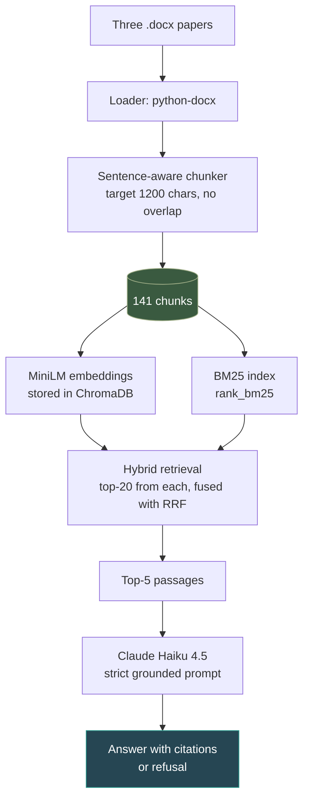
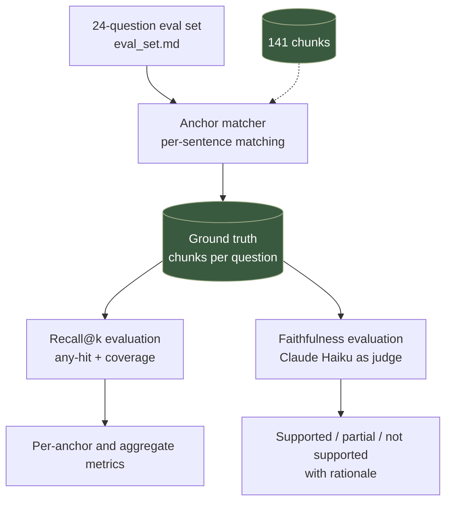

# RAG Bioacoustics

Retrieval-augmented generation over three bioacoustics research papers, with an evaluation framework that measured three documented iterations of retrieval improvements — including one negative result.

**[Live demo](https://qianfu-rag-bioacoustics.streamlit.app/) · [How it works](#architecture) · [Results](#results)**

## Try the demo

Start with **Q12**: *"How did the performance of the gunshot detection algorithm evolve across its iterations, including how the first deployment informed the redesign?"*

This question was a documented failure case in baseline retrieval — the relevant content lived in two separate chunks describing different deployment iterations of the algorithm, and baseline retrieval consistently retrieved one but not both. Iteration 1 (bigger chunks) brought one of the two into the top-5; Iteration 3 (hybrid retrieval) brought both. The demo shows the eval framework's view of this question: ground-truth chunks, retrieved chunks, recall@5 score, and the LLM-as-judge's faithfulness verdict, all in one view.

## Results

- **Overall recall@5 coverage: 0.60 → 0.88** across three retrieval iterations (chunk size, chunk overlap, hybrid retrieval).
- **Faithfulness held at 0.98** across all iterations (LLM-as-judge over 24 questions; documented limitation on Q17).
- **24-question evaluation suite** spanning 5 question categories: single-fact, synthesis, cross-doc, numerical, and refusal — with 29 of 30 retrieval anchors fully matched to ground-truth chunks (one documented Unicode-math limitation).

Iteration 2 was a negative result — chunk overlap regressed coverage and was reverted. The eval framework caught this directly via per-anchor analysis, not just aggregate metrics. Full per-iteration details in [`evals/ITERATION.md`](evals/ITERATION.md).

## What this project is

A retrieval-augmented generation system over three open-access research papers in bioacoustics: a neuroethology review, the OpenSoundscape methods paper, and the AudioMoth deployment paper. Given a question, the system retrieves the most relevant passages from the corpus and uses them to generate a grounded answer with citations — refusing to answer when the passages don't contain enough information.

The project's emphasis is not the RAG pipeline itself, which uses standard components (sentence-transformers, ChromaDB, BM25, Claude Haiku). The emphasis is the **evaluation framework built alongside it**: a hand-curated 24-question eval set with verified ground-truth chunks, recall@k metrics with both hit and coverage scoring, LLM-as-judge faithfulness evaluation, and an explicit refusal handling. The framework was used to measure three iterations of retrieval improvements — including a documented negative result that was caught by per-anchor analysis.

## Architecture

The project has two parallel pipelines that share a corpus of chunked text: a **production pipeline** that serves queries, and an **evaluation pipeline** that measures retrieval and generation quality.

### Production pipeline



### Evaluation pipeline



The dashed arrow into the anchor matcher shows that the eval pipeline reads the same chunks the production pipeline uses — the eval framework verifies retrieval *on the actual production corpus*, not a separate test fixture.

## The iteration story

**Iteration 1: chunk size 800 → 1200.** Baseline retrieval used 800-character chunks. Several anchor sentences spanned chunk boundaries, splitting their information across multiple chunks and degrading retrieval quality. Increasing chunk size to 1200 consolidated most multi-sentence anchors into single chunks. Overall recall@5 coverage moved 0.60 → 0.77. Synthesis questions saw the largest gain (cov@5 0.54 → 0.79), confirming that consolidation was the dominant effect.

**Iteration 2: chunk overlap 0 → 200 (reverted).** The hypothesis: overlap would let boundary content appear in both adjacent chunks, extending consolidation. Instead, coverage *regressed* — overall cov@5 dropped from 0.77 back to 0.65. Per-anchor analysis revealed the mechanism: overlap blended neighboring content into each chunk's embedding, diluting the semantic distinctiveness that drove Iter 1's gains. Identical any@5 numbers to baseline across every category confirmed this wasn't noise — ranking quality had returned to baseline. Faithfulness also dropped (a real generation error on Q15 that the eval framework caught). Reverted to Iter 1 config.

**Iteration 3: hybrid retrieval (BM25 + semantic, RRF fusion).** Iter 2 revealed that residual cross-doc failures were ranking-bound, not chunking-bound — the right chunks existed but couldn't reach the top-5 via semantic similarity alone. Adding BM25 as a complementary retriever and fusing both rankings via reciprocal rank fusion moved overall cov@5 from 0.77 to 0.88. The primary ranking-bound failure (Q16 a1) recovered fully. Three other cross-doc failures (Q14 a1, Q14 a2, Q15 a2) did *not* recover, and inspection of what hybrid retrieved revealed a third failure mode: query-document vocabulary mismatch, where the question asks about a concept ("practical constraints") while the answer chunks use specific technical vocabulary ("depthwise separable convolution"). Neither lexical nor dense similarity bridges that gap. The natural next step would be query expansion or HyDE.

Full per-iteration analysis with predictions, results, and refined diagnoses in [`evals/ITERATION.md`](evals/ITERATION.md).

## Evaluation framework

The eval framework has three components, each addressing a different question about RAG quality.

**Anchor matcher (`evals/match_anchors.py`).** For each question in the eval set, an "anchor" is a short text span (1-6 sentences) that contains the information needed to answer it. The matcher identifies which corpus chunks contain each anchor's sentences, then collapses these into the ground-truth chunk set per question. Multi-sentence anchors are matched per-sentence to handle cases where information spans a chunk boundary. Of 30 fact-based anchors across the eval set, 29 are fully matched and 1 has a documented Unicode-math limitation.

**Recall@k (`evals/recall_at_k.py`).** Standard information-retrieval recall at top-k (k=3, 5, 10). Two complementary metrics per question:
- **any-hit:** did retrieval find at least one ground-truth chunk in the top-k?
- **coverage:** what fraction of ground-truth chunks did retrieval find?

Any-hit captures whether retrieval succeeded at all. Coverage captures *how completely*. Both are aggregated by question category (single-fact, synthesis, cross-doc, numerical) and overall.

**Faithfulness (`evals/faithfulness.py`).** Claude Haiku as an LLM-as-judge, evaluating whether each generated answer's claims are supported by the retrieved passages. Three-level verdicts: supported / partially supported / not supported, with a rationale and specific unsupported-claims list for non-supported cases. The judge is given strict instructions to evaluate *supportedness* (claims grounded in retrieved text), not *correctness* (whether claims are objectively true). This separation matters: a generator could hallucinate a factually-true claim that isn't in the retrieved passages — the eval framework should still flag this.

The framework was developed alongside the RAG pipeline and applied to each iteration. Per-question audit trails are saved as JSON in `evals/`, with one file per metric per configuration: `recall_at_k_*.json`, `faithfulness_*.json`, `ground_truth_*.json`.

## Reproducing the project

```bash
# Clone
git clone https://github.com/QianFu520/rag-bioacoustics.git
cd rag-bioacoustics

# Install dependencies (Python 3.12)
pip install -r requirements.txt

# Set up the Anthropic API key
echo "ANTHROPIC_API_KEY=your-key-here" > .env

# Build the chunks, embeddings, and BM25 index
python build_store.py

# (Optional) Run the eval framework
python evals/match_anchors.py
python evals/recall_at_k.py
python evals/faithfulness.py

# (Optional) Run the Streamlit demo locally
streamlit run app.py
```

The build script chunks the three papers, creates MiniLM embeddings stored in ChromaDB, and builds a BM25 index — all in ~30 seconds on a modern laptop. The eval framework runs in another ~1 minute total; faithfulness uses Claude Haiku API calls (~$0.10 per full run).

## Known limitations

**Three cross-doc retrieval failures remain unrecovered.** Q14 a1, Q14 a2, and Q15 a2 — described in The iteration story (Iter 3) — represent a query-document vocabulary mismatch that neither lexical nor dense retrieval bridges. The right next intervention is query expansion or HyDE, neither of which this project implements.

**Q17 faithfulness shows reproducible judge variance.** Across four eval runs (baseline, iter 1, iter 2, iter 3), the Q17 generated answer consistently returns a partially-supported verdict from the judge. The judge's specific concern (whether the cited metrics attribute explicitly to the soprano pipistrelle dataset) is at the boundary of LLM-as-judge reliability for this kind of claim. The pattern is documented as judge variance, not a generation regression.

**Q11 anchor 2 has a documented Unicode-math limitation.** One sentence in the anchor contains Unicode mathematical notation (𝒪⁢(𝐿)) that the matcher's normalizer can't reliably handle. This is 1 of 30 anchors; documented in [`evals/NORMALIZER_NOTES.md`](evals/NORMALIZER_NOTES.md).

**The generator and judge share the same model (Claude Haiku 4.5).** A more rigorous setup would use a different model for the judge to avoid shared bias in interpreting language. Spot-checking the judge's rationales suggests the verdicts are reliable, but this is a real methodological limitation.

**Other practical limitations:**
- The corpus is three papers — small enough that the eval framework's signal is sharp but the absolute numbers shouldn't be over-generalized to larger corpora
- No streaming, async retrieval, or batched evaluation — fine for a research/demo project, not for production
- The Streamlit Cloud deployment has cold-start delays (~30s) after periods of inactivity

Full normalizer behavior and judge prompt design in [`evals/NORMALIZER_NOTES.md`](evals/NORMALIZER_NOTES.md).

## Tech stack

- **Language:** Python 3.12
- **Document loading:** python-docx
- **Embeddings:** sentence-transformers (`all-MiniLM-L6-v2`)
- **Vector store:** ChromaDB
- **Lexical retrieval:** rank-bm25
- **Generation and judging:** Anthropic SDK (Claude Haiku 4.5)
- **UI / demo:** Streamlit
- **Data display:** pandas
- **Deployment:** Streamlit Cloud (free tier)

Full pinned versions in [`requirements.txt`](requirements.txt).