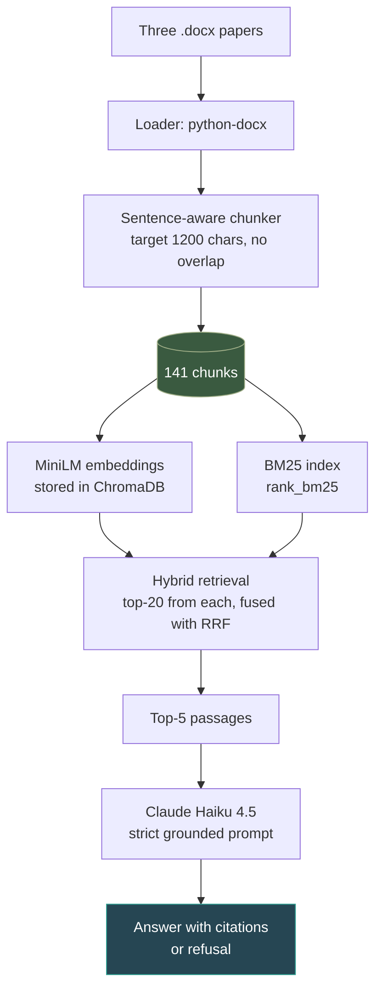
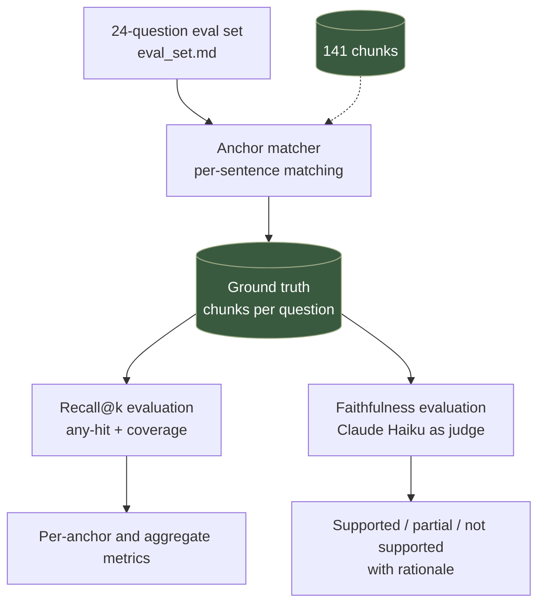

# RAG Bioacoustics

Retrieval-augmented generation over three bioacoustics research papers, with an evaluation framework that measured three documented iterations of retrieval improvements — including one negative result.

**[Live demo](https://qianfu-rag-bioacoustics.streamlit.app/) · [How it works](#architecture) · [Results](#results)**

## Try the demo

The most informative thing to try is **Q12**: *"How did the performance of the gunshot detection algorithm evolve across its iterations, including how the first deployment informed the redesign?"*

This question was a documented failure case in baseline retrieval — the relevant content lived in two separate chunks describing different deployment iterations of the algorithm, and baseline retrieval consistently retrieved one but not both. Iteration 1 (bigger chunks) brought one of the two into the top-5; Iteration 3 (hybrid retrieval) brought both. The demo lets you watch the eval framework verify this: ground-truth chunks, retrieved chunks, recall@5 score, and the LLM-as-judge's faithfulness verdict, all in one view.

## Results

- **Overall recall@5 coverage: 0.60 → 0.88** across three retrieval iterations (chunk size, chunk overlap, hybrid retrieval).
- **Faithfulness held at 0.98** across all iterations (LLM-as-judge over 24 questions; documented limitation on Q17).
- **24-question evaluation suite** spanning 5 question categories: single-fact, synthesis, cross-doc, numerical, and refusal — with 29 of 30 retrieval anchors fully matched to ground-truth chunks (one documented Unicode-math limitation).

Iteration 2 was a negative result — chunk overlap regressed coverage and was reverted. The eval framework caught this directly via per-anchor analysis, not just aggregate metrics. Full per-iteration details in [`evals/ITERATION.md`](evals/ITERATION.md).

## What this project is

A retrieval-augmented generation system over three open-access research papers in bioacoustics: a neuroethology review, the OpenSoundscape methods paper, and the AudioMoth deployment paper. Given a question, the system retrieves the most relevant passages from the corpus and uses them to generate a grounded answer with citations — refusing to answer when the passages don't contain enough information.

The project's emphasis is not the RAG pipeline itself, which uses standard components (sentence-transformers, ChromaDB, BM25, Claude Haiku). The emphasis is the **evaluation framework built alongside it**: a hand-curated 24-question eval set with verified ground-truth chunks, recall@k metrics with both hit and coverage scoring, LLM-as-judge faithfulness evaluation, and a strict refusal handling protocol. The framework was used to measure three iterations of retrieval improvements — including a documented negative result that was caught by per-anchor analysis.

## Architecture

The project has two parallel pipelines that share a corpus of chunked text: a **production pipeline** that serves queries, and an **evaluation pipeline** that measures retrieval and generation quality.

### Production pipeline

### Evaluation pipeline

The dashed arrow into the anchor matcher shows that the eval pipeline reads the same chunks the production pipeline uses — the eval framework verifies retrieval *on the actual production corpus*, not a separate test fixture.
