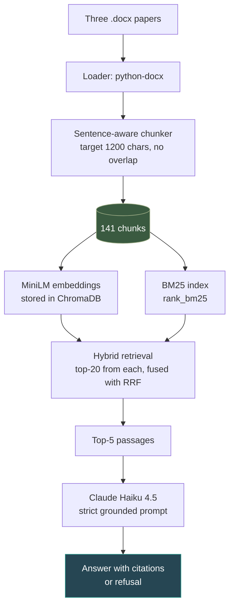
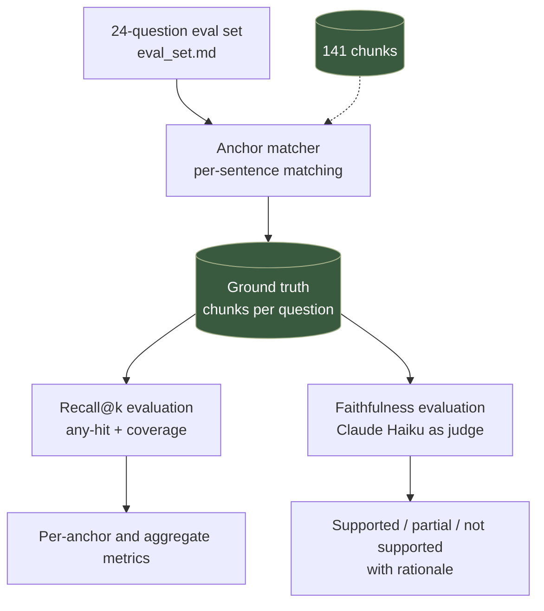

# RAG Bioacoustics

Retrieval-augmented generation over three bioacoustics research papers, with an evaluation framework that measured three documented iterations of retrieval improvements — including one negative result. Extended with a FastAPI service, Docker deployment, GitHub Actions CI eval gate, and a LangGraph agentic retrieval layer.

**[Live demo](https://qianfu-rag-bioacoustics.streamlit.app/) · [How it works](#architecture) · [Results](#results)**

## Try the demo

Start with **Q12**: *"How did the performance of the gunshot detection algorithm evolve across its iterations, including how the first deployment informed the redesign?"*

This question was a documented failure case in baseline retrieval — the relevant content lived in two separate chunks describing different deployment iterations of the algorithm, and baseline retrieval consistently retrieved one but not both. Iteration 1 (bigger chunks) brought one of the two into the top-5; Iteration 3 (hybrid retrieval) brought both. The demo shows the eval framework's view of this question: ground-truth chunks, retrieved chunks, recall@5 score, and the LLM-as-judge's faithfulness verdict, all in one view.

## Results

- **Overall recall@5 coverage: 0.60 → 0.88** across three retrieval iterations (chunk size, chunk overlap, hybrid retrieval). A fourth agentic iteration (LangGraph query routing) achieved parity with the hybrid baseline.
- **Faithfulness held at 0.98** across all retrieval iterations (LLM-as-judge over 24 questions; documented limitation on Q17).
- **24-question evaluation suite** spanning 5 question categories: single-fact, synthesis, cross-doc, numerical, and refusal — with 29 of 30 retrieval anchors fully matched to ground-truth chunks (one documented Unicode-math limitation).

Iterations 2 and 4 were negative results — both caught and documented by the eval framework. Full per-iteration details in [`evals/ITERATION.md`](evals/ITERATION.md).

## What this project is

A retrieval-augmented generation system over three open-access research papers in bioacoustics: a neuroethology review, the OpenSoundscape methods paper, and the AudioMoth deployment paper. Given a question, the system retrieves the most relevant passages from the corpus and uses them to generate a grounded answer with citations — refusing to answer when the passages don't contain enough information.

The project's emphasis is not the RAG pipeline itself, which uses standard components (sentence-transformers, ChromaDB, BM25, Claude Haiku). The emphasis is the **evaluation framework built alongside it**: a hand-curated 24-question eval set with verified ground-truth chunks, recall@k metrics with both hit and coverage scoring, LLM-as-judge faithfulness evaluation, and an explicit refusal handling. The framework was used to measure four iterations — three retrieval (chunk size, overlap, hybrid) and one agentic (LangGraph routing) — including two documented negative results caught by per-anchor and per-category analysis.

## Architecture

The project has two parallel pipelines that share a corpus of chunked text: a **production pipeline** that serves queries, and an **evaluation pipeline** that measures retrieval and generation quality.

### Production pipeline


```mermaid
graph TD
    A[Three .docx papers] --> B[Loader: python-docx]
    B --> C[Sentence-aware chunker<br/>target 1200 chars, no overlap]
    C --> D[(141 chunks)]
    D --> E[MiniLM embeddings<br/>stored in ChromaDB]
    D --> F[BM25 index<br/>rank_bm25]
    E --> G[Hybrid retrieval<br/>top-20 from each, fused with RRF]
    F --> G
    G --> H[Top-5 passages]
    H --> I[Claude Haiku 4.5<br/>strict grounded prompt]
    I --> J[Answer with citations<br/>or refusal]

    style D fill:#3a5a40,stroke:#a3b18a,color:#fff
    style J fill:#264653,stroke:#2a9d8f,color:#fff
```

### Evaluation pipeline


```mermaid
graph TD
    A["24-question eval set<br/>eval_set.md"] --> B["Anchor matcher<br/>per-sentence matching"]
    K[("141 chunks")] -.-> B
    B --> C[("Ground truth<br/>chunks per question")]
    C --> D["Recall@k evaluation<br/>any-hit + coverage"]
    C --> E["Faithfulness evaluation<br/>Claude Haiku as judge"]
    D --> F["Per-anchor and aggregate metrics"]
    E --> G["Supported / partial / not supported<br/>with rationale"]

    style K fill:#3a5a40,stroke:#a3b18a,color:#fff
    style C fill:#3a5a40,stroke:#a3b18a,color:#fff
```

The dashed arrow into the anchor matcher shows that the eval pipeline reads the same chunks the production pipeline uses — the eval framework verifies retrieval *on the actual production corpus*, not a separate test fixture.

## Extensions

Four additions built on top of the core RAG pipeline.

### FastAPI service

`api.py` wraps the pipeline as a REST API with two endpoints:

- **`POST /query`** — direct hybrid retrieval. Takes a question and optional `k`, returns `answer`, `citations`, and `chunks`.
- **`POST /query/agentic`** — LangGraph graph (see below). Same inputs; additionally returns `route` and `sub_questions`.

```bash
uvicorn api:app --reload
curl -X POST http://localhost:8000/query \
  -H "Content-Type: application/json" \
  -d '{"question": "What is the detection range of the AudioMoth gunshot algorithm?"}'
```

The API uses FastAPI's lifespan context manager to load the ChromaDB collection and Anthropic client once at startup. On a fresh container with an empty collection, the startup handler builds the index automatically before accepting requests.

### Docker

`Dockerfile` and `docker-compose.yml` run the FastAPI app and ChromaDB as separate containers:

```bash
docker compose up --build
```

The app container sets `CHROMA_HOST=chromadb` to connect to the ChromaDB container via `HttpClient` rather than `PersistentClient`. The same code runs locally with a local `PersistentClient` (no `CHROMA_HOST` set). ChromaDB is exposed on host port 8001; the app on 8000.

### GitHub Actions CI

`.github/workflows/eval.yml` runs the recall@k eval on every push to `main`:

1. Build the BM25 and ChromaDB indexes from the source papers
2. Run the anchor matcher to confirm ground-truth chunks
3. Run `evals/recall_at_k.py` and save the result
4. Check the gate: fail the build if overall `cov@5 < 0.85`

The gate uses no LLM calls — recall@k is deterministic and free to run in CI. The artifact (`recall_at_k.json`) is uploaded on every run. The 0.85 threshold is below the current production score (0.88), so the gate fires on real regressions, not noise.

### LangGraph agentic layer

`rag_graph.py` adds an agentic retrieval path via LangGraph's `StateGraph`:

```
route_query → [simple] → retrieve → generate
             [complex] → decompose → retrieve_multi → generate
```

The router (Claude Haiku) classifies questions as simple (one topic) or complex (comparative, multi-paper). Complex questions are decomposed into 2–3 sub-questions, each retrieved independently, then merged and re-ranked by hybrid score on the original question before generation.

**Measured result:** overall `cov@5 = 0.88` — identical to the hybrid baseline. The architecture is correct and the routing fires as expected, but re-ranking the merged pool by the original question's hybrid score collapses the result back to what direct hybrid retrieval returns. The agentic layer adds two LLM calls per complex question without improving recall. Full analysis in [`evals/ITERATION.md`](evals/ITERATION.md) (Iteration 4, attempts 1 and 2).

The `/query/agentic` endpoint and `rag_graph.py` remain in the codebase as a working demonstration of agentic RAG design.

---

## The iteration story

**Iteration 1: chunk size 800 → 1200.** Baseline retrieval used 800-character chunks. Several anchor sentences spanned chunk boundaries, splitting their information across multiple chunks and degrading retrieval quality. Increasing chunk size to 1200 consolidated most multi-sentence anchors into single chunks. Overall recall@5 coverage moved 0.60 → 0.77. Synthesis questions saw the largest gain (cov@5 0.54 → 0.79), confirming that consolidation was the dominant effect.

**Iteration 2: chunk overlap 0 → 200 (reverted).** The hypothesis: overlap would let boundary content appear in both adjacent chunks, extending consolidation. Instead, coverage *regressed* — overall cov@5 dropped from 0.77 back to 0.65. Per-anchor analysis revealed the mechanism: overlap blended neighboring content into each chunk's embedding, diluting the semantic distinctiveness that drove Iter 1's gains. Identical any@5 numbers to baseline across every category confirmed this wasn't noise — ranking quality had returned to baseline. Faithfulness also dropped (a real generation error on Q15 that the eval framework caught). Reverted to Iter 1 config.

**Iteration 3: hybrid retrieval (BM25 + semantic, RRF fusion).** Iter 2 revealed that residual cross-doc failures were ranking-bound, not chunking-bound — the right chunks existed but couldn't reach the top-5 via semantic similarity alone. Adding BM25 as a complementary retriever and fusing both rankings via reciprocal rank fusion moved overall cov@5 from 0.77 to 0.88. The primary ranking-bound failure (Q16 a1) recovered fully. Three other cross-doc failures (Q14 a1, Q14 a2, Q15 a2) did *not* recover, and inspection of what hybrid retrieved revealed a third failure mode: query-document vocabulary mismatch, where the question asks about a concept ("practical constraints") while the answer chunks use specific technical vocabulary ("depthwise separable convolution"). Neither lexical nor dense similarity bridges that gap.

**Iteration 4: LangGraph agentic routing (parity with baseline).** A LangGraph layer was added on top of hybrid retrieval: a Claude Haiku router classifies each question as simple or complex; complex questions are decomposed into sub-questions, each retrieved independently, then merged and re-ranked before generation. Two attempts were run. Attempt 1 regressed overall cov@5 from 0.88 to 0.73 due to router misclassification of synthesis questions and an unranked merge discarding relevance order. Attempt 2 fixed both bugs — synthesis recovered fully and cross-doc recovered to baseline — but overall cov@5 remained 0.88, identical to the hybrid baseline. The re-ranking step (by the original question's hybrid score) collapses sub-question diversity back to what direct hybrid retrieval returns. The agentic architecture is correct and demonstrably functional; it does not improve recall on this corpus.

Full per-iteration analysis with predictions, results, and refined diagnoses in [`evals/ITERATION.md`](evals/ITERATION.md).

## Evaluation framework

The eval framework has three components, each addressing a different question about RAG quality.

**Anchor matcher (`evals/match_anchors.py`).** For each question in the eval set, an "anchor" is a short text span (1-6 sentences) that contains the information needed to answer it. The matcher identifies which corpus chunks contain each anchor's sentences, then collapses these into the ground-truth chunk set per question. Multi-sentence anchors are matched per-sentence to handle cases where information spans a chunk boundary. Of 30 fact-based anchors across the eval set, 29 are fully matched and 1 has a documented Unicode-math limitation.

**Recall@k (`evals/recall_at_k.py`).** Standard information-retrieval recall at top-k (k=3, 5, 10). Two complementary metrics per question:
- **any-hit:** did retrieval find at least one ground-truth chunk in the top-k?
- **coverage:** what fraction of ground-truth chunks did retrieval find?

Any-hit captures whether retrieval succeeded at all. Coverage captures *how completely*. Both are aggregated by question category (single-fact, synthesis, cross-doc, numerical) and overall.

**Faithfulness (`evals/faithfulness.py`).** Claude Haiku as an LLM-as-judge, evaluating whether each generated answer's claims are supported by the retrieved passages. Three-level verdicts: supported / partially supported / not supported, with a rationale and specific unsupported-claims list for non-supported cases. The judge is given strict instructions to evaluate *supportedness* (claims grounded in retrieved text), not *correctness* (whether claims are objectively true). This separation matters: a generator could hallucinate a factually-true claim that isn't in the retrieved passages — the eval framework should still flag this.

The framework was developed alongside the RAG pipeline and applied to each iteration. Per-question audit trails are saved as JSON in `evals/`, with one file per metric per configuration: `recall_at_k_*.json`, `faithfulness_*.json`, `ground_truth_*.json`.

## Reproducing the project

**Local (Streamlit demo):**

```bash
git clone https://github.com/QianFu520/rag-bioacoustics.git
cd rag-bioacoustics
pip install -r requirements.txt
echo "ANTHROPIC_API_KEY=your-key-here" > .env
python build_store.py
streamlit run app.py
```

**Local (FastAPI):**

```bash
python build_store.py          # build indexes if not already built
uvicorn api:app --reload       # serves on http://localhost:8000
# POST /query or /query/agentic
```

**Docker:**

```bash
echo "ANTHROPIC_API_KEY=your-key-here" > .env
docker compose up --build
# app on http://localhost:8000, ChromaDB on http://localhost:8001
# indexes are built automatically on first startup if the collection is empty
```

**Eval framework:**

```bash
python evals/match_anchors.py          # verify ground-truth chunk mapping
python evals/recall_at_k.py            # hybrid baseline recall@k
python evals/recall_at_k.py --agentic  # agentic path recall@k
python evals/faithfulness.py           # LLM-as-judge (~$0.10 per full run)
```

The build script chunks the three papers, creates MiniLM embeddings stored in ChromaDB, and builds a BM25 index — all in ~30 seconds on a modern laptop.

## Known limitations

**Three cross-doc retrieval failures remain unrecovered.** Q14 a1, Q14 a2, and Q15 a2 — described in The iteration story (Iter 3) — represent a query-document vocabulary mismatch that neither lexical nor dense retrieval bridges. The right next intervention is query expansion or HyDE, neither of which this project implements.

**Q17 faithfulness shows reproducible judge variance.** Across all retrieval eval runs (baseline, iter 1, iter 2, iter 3), the Q17 generated answer consistently returns a partially-supported verdict from the judge. The judge's specific concern (whether the cited metrics attribute explicitly to the soprano pipistrelle dataset) is at the boundary of LLM-as-judge reliability for this kind of claim. The pattern is documented as judge variance, not a generation regression.

**Q11 anchor 2 has a documented Unicode-math limitation.** One sentence in the anchor contains Unicode mathematical notation (𝒪⁢(𝐿)) that the matcher's normalizer can't reliably handle. This is 1 of 30 anchors; documented in [`evals/NORMALIZER_NOTES.md`](evals/NORMALIZER_NOTES.md).

**The generator and judge share the same model (Claude Haiku 4.5).** A more rigorous setup would use a different model for the judge to avoid shared bias in interpreting language. Spot-checking the judge's rationales suggests the verdicts are reliable, but this is a real methodological limitation.

**Other practical limitations:**
- The corpus is three papers — small enough that the eval framework's signal is sharp but the absolute numbers shouldn't be over-generalized to larger corpora
- No streaming, async retrieval, or batched evaluation — fine for a research/demo project, not for production
- The Streamlit Cloud deployment has cold-start delays (~30s) after periods of inactivity

Full normalizer behavior and judge prompt design in [`evals/NORMALIZER_NOTES.md`](evals/NORMALIZER_NOTES.md).

## Tech stack

- **Language:** Python 3.12
- **Document loading:** python-docx
- **Embeddings:** sentence-transformers (`all-MiniLM-L6-v2`)
- **Vector store:** ChromaDB
- **Lexical retrieval:** rank-bm25
- **Generation and judging:** Anthropic SDK (Claude Haiku 4.5)
- **REST API:** FastAPI + uvicorn
- **Agentic layer:** LangGraph (`StateGraph`, conditional edges)
- **Containerization:** Docker + docker-compose
- **CI:** GitHub Actions (recall@k eval gate)
- **UI / demo:** Streamlit
- **Data display:** pandas
- **Deployment:** Streamlit Cloud (free tier)

Full dependency versions in [`requirements.txt`](requirements.txt).